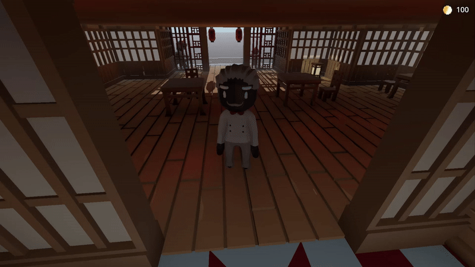
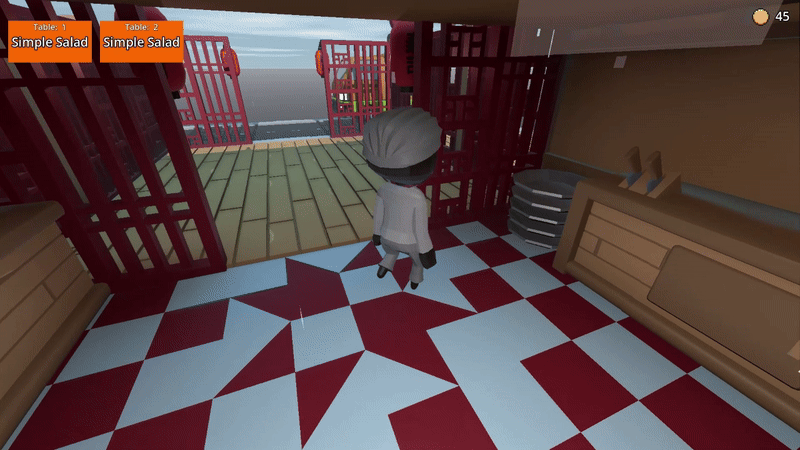
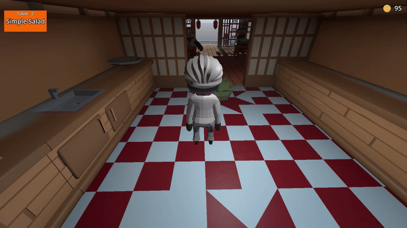

# Project 00 Chef - Portfolio Game

## Gameplay Mechanics Showcase

### Customer Service System

- Customer arrives at restaurant and approaches counter
- NPC greeting and order taking interaction
- Order selection UI (salad chosen)

### Ingredient & Cooking System

- **Supply System**:
  - Mobile ingredient vendor that visits periodically
  - Purchasing fresh produce interface
- **Food Prep Mechanics**:
  - Washing station
  - Chopping mechanic
  - Plate assembly and order delivery

### Graphics Settings

- Real-time graphics configuration panel
- Instant visual feedback when changing settings
- Quality presets and individual options
